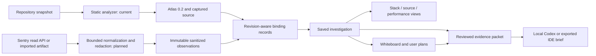

# Codandy architecture

## Current implementation and proposed extension

The current React/Vinext UI talks to a local FastAPI service for bounded static analysis, retained source and reports. The debugging pivot adds a separate investigation domain; it does not replace static ingestion or authorize running analyzed repositories. New components described below are planned unless explicitly marked current.

## Preserve the static boundary

Current artifact: `.codandy/atlas.json`, schema 0.2. No graph.json migration is needed. The actual relationship enum is CONTAINS, IMPORTS, RESOLVES_TO, DEPENDS_ON, ROUTES_TO and CALLS. Some relationships are inferred or unresolved. READS, WRITES, PUBLISHES, TESTS and similar semantic relationships are future work, not available merely because earlier architecture documents listed them.

Node IDs derive from kind, path and name. They are deterministic for those inputs, not stable through every move/rename. Runtime references use `(snapshot_id, node_id)` plus repository/revision metadata. New observations never mutate the atlas, silently resolve static edges or upgrade rule confidence.

Git ingestion remains isolated and bounded. Codandy's analyzer process can run its own parser, never repository builds, hooks, scripts, tests, package managers or plugins. Secret/binary/excluded paths remain inaccessible. Tree-sitter remains pinned below 0.26 because of the documented native-memory regression.

The current source viewer addresses only captured indexed paths; atlas files do not embed source bodies. Retained sources have per-file/total budgets and expire with their report unless explicitly retained by a future investigation policy.

## Proposed investigation contracts

| Record | Required basis |
|---|---|
| Connection | Provider, approved host/region, selected organization/project, capability status, opaque credential reference |
| Observation | Schema version, provider/event identity, occurred/fetched timestamps, environment/release, sanitized payload, redaction/truncation metadata |
| Frame | Provider frame index/order, exception/thread identity, optional function/path/line/column; absent values stay absent |
| Source binding | Observation/frame reference, snapshot/revision, candidate nodes, method and exact/candidate/ambiguous/unmapped status |
| Investigation | Case ID, title/state, pinned observation IDs and snapshot references, notes, hypothesis versions and verification references |
| Claim | observed/static-inferred/hypothesis/user-plan basis, evidence IDs, limitations, status; no model-created factual confidence score |
| Board | Versioned scene, text/intent, evidence-card references, proposed tasks, attachment references and export metadata |

Observations are immutable after normalization; refreshing provider data creates another version. User annotations and hypothesis states are mutable, with history. "Append-only" does not mean forever retained: explicit deletion and retention policies must remove cases, observations, board assets and unused source snapshots consistently.

Keep each schema version separate. Validate server/client contracts with Pydantic/Zod and reject dangling evidence IDs. A provider event without a source match remains a valid investigation. Missing revision evidence must remain visible even if the displayed source looks plausible.

## Provider boundary

Start with Sentry Cloud and offline fixtures, pending account selection. FastAPI makes bounded authenticated GET requests to a configured allowed host. Accept IDs/validated issue references, never arbitrary request URLs. Scope every lookup/cache key to the connection and organization/project. Do not let pagination links or redirects forward credentials to another host.

Initial authentication is a protected local-only settings operation using a backend-held read token. Return connection metadata, never secrets. Hosted/multi-user authentication and self-hosted endpoint support need separate designs. A frontend SDK DSN is not a general Sentry read token, and a Codex login grants no Sentry access.

Use deadline, byte/depth limits, bounded retries, cancellation and rate-limit-aware backoff. Do not launch background whole-organization polling. Webhooks require verified signatures and a durable public receiver later; the local Codex endpoint must never become that receiver. See [research](docs/DEBUGGING-STRATEGY.md) for endpoint and scope sources.

## Local persistence

Current report persistence uses atomic, bounded JSON snapshots via CODANDY_REPORT_ROOT, with one owning API process. Preserve it. Proposed investigations use a separate local SQLite store plus bounded attachment storage; finalize schema/migration tests in D1 before implementation. This supports transactions and case/evidence indexing without claiming shared-worker readiness.

An investigation must either pin a source snapshot or explicitly show expired/unavailable source. Report deletion must report referenced-case consequences; no silent cascade or dangling exact-source claim. Restore is schema-validated. Store sanitized evidence by default, not wholesale provider event bodies. Define local retention and explicit case deletion before supporting live import.

## AI and plans

Current AI uses an isolated Codex-managed profile, ChatGPT authentication and tool-disabled ephemeral threads. Current answers validate schema and supplied graph citation IDs; they do not establish factual correctness. Preserve the local-only host/header/origin checks and lack of API-key fallback.

Extend the reviewable context builder to typed investigation evidence only after normalization and case authorization. Observed data, static candidates, user notes and hypotheses remain separate in prompts and output. Source snippets/telemetry require explicit review, a bounded allowlist and redaction. Unknown evidence IDs invalidate a response; valid IDs alone do not prove a diagnosis. Never automatically send everything visible on a board.

A whiteboard owns plans and annotations, not graph facts. Export text/evidence first; current AI requests do not support arbitrary board-image reasoning. A future read-only MCP server wraps the same case services. Enabling external provider tools inside Codex is not part of this pivot's initial implementation.

## Performance and trusted execution

Stack snapshots, trace spans, profiles and live debugger state are distinct observation types. Do not infer time from stack order or source length. Keep timing units, sample basis, environment, observation window and missing-data state with every metric. Bind spans to code only with suitable attributes or explicit mappings.

A later DAP service must be a separate opt-in execution boundary for a selected trusted local workspace/adapter. It may not reuse the untrusted clone worker or accept launch/evaluate commands from telemetry, board imports or automatic AI output. Importing externally generated test/profile artifacts does not run them.

## Deployment and compatibility

Local services remain on localhost:5173 and 127.0.0.1:8000. The active checkout is C:/Users/andre/source/repos/codandy; the archived code-atlas checkout must never contribute Git history. Use only abwalls and the configured GitHub no-reply identity.

Hosted Sites can serve the UI/sample but cannot execute the Python/Git/native parser. Its assistant routes remain intentionally unavailable. Real hosted investigation data requires a separately secured backend, tenant/connection authorization and secret storage. Do not imply the private preview now has a Sentry integration.

CODANDY_* settings are canonical; legacy settings/header aliases and the browser theme storage key remain supported. Existing atlas/report imports remain compatible. This documentation change adds no runtime migrations, integrations or new UI behavior.

## Implemented investigation slice (2026-09-14)

`SavedCase` (case-0.1) persists one immutable sanitized observation, editable user annotations/status, a selected snapshot identity and candidate SourceBinding records. Atomic bounded local files are independent of report eviction. Source text remains governed by the existing captured-source endpoint; expired snapshots stay explicitly unavailable. Brief packets include bounded frame IDs, user annotations and binding provenance; exact packet digests bind review to local Codex submission. Neither the diagram nor source matching adds edges to atlas 0.2.

Tests override application storage and provider settings in an autouse fixture. This protects personal data even when backend/.env enables report persistence or local provider connections.
